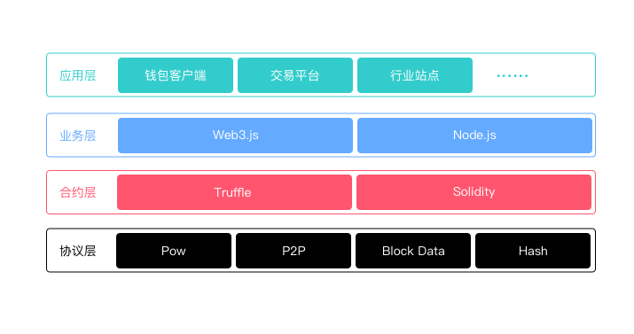

# 区块链
区块链技术早在 2009 年中本聪发明的比特币中得到和应用

## 概念 & 专有名词

* 数字货币
* 数字资产
* 智能合约
* 去中心化
* 比特币、以太币
* 以太坊
* 公有区块链
* 联合区块链
* 私有区块链
* P2P
* 分布式
* Hash
* 区块
* 创世区块
* 工作量证明
* Gas
* 挖矿
* DApp

## 发展历史
* 2008-10-31：中本聪提出了比特币的设计白皮书；
* 2009-01-03：第一个比特币生成；
* 2010-05-21：第一次比特币交易，佛罗里达程序员 Laszlo Hanyecz 用1万比特币购买了价值25美元的披萨优惠券；
* 2010-07-16：比特币价格从 0.008 美元升值 0.08 美元，第一次价格的剧烈波动，显示新生事物的崛起；
* 2010-07-17：第一个比特币平台成立;
* 2014-09-09：美国电商巨头eBay宣布，该公司旗下支付处理子公司 Braintree 将开始接受比特币支付。该公司已与比特币交易平台Coinbase达成合作，开始接受这种相对较新的支付手段；
* 

## 实现原理
### 基本概念
* 交易：一次操作，导致账本状态的一次改变；
* 区块：记录一段时间内发生的交易和状态结果，是对当前账本状态的一次共识；
* 链：由一个个区块按照发生顺序串联而成，是整个状态变化的日志记录。

### 记账内容
* 版本信息
* 上一个区块的 Hash 值
* 记账时间
* 难度值
* 交易信息

### 分布式账本
* 每个节点（设备）都有一份完整的区块链
* 可以通过完整的区块链来验证新交易的正确性
* 通过 P2P 网络来同步每个节点

### 共识机制 Pow（工作量证明）
* 激励
* Hash 计算

## 技术架构

* 应用层：各种数字钱包、交易网站或者各个不同行业的基于区块链搭建的网站或者 App；
* 业务层：业务层主要还是 Web3 对智能合约的操作，当然也有各个不通应用自己的业务功能模块；
* 合同层：合同层主要是通过 Solidity 对各个合同的实现；
* 协议层：主要是通过共识机制、P2P 网络、区块链存储和密码学相关技术，来对区块链底层的实现；
